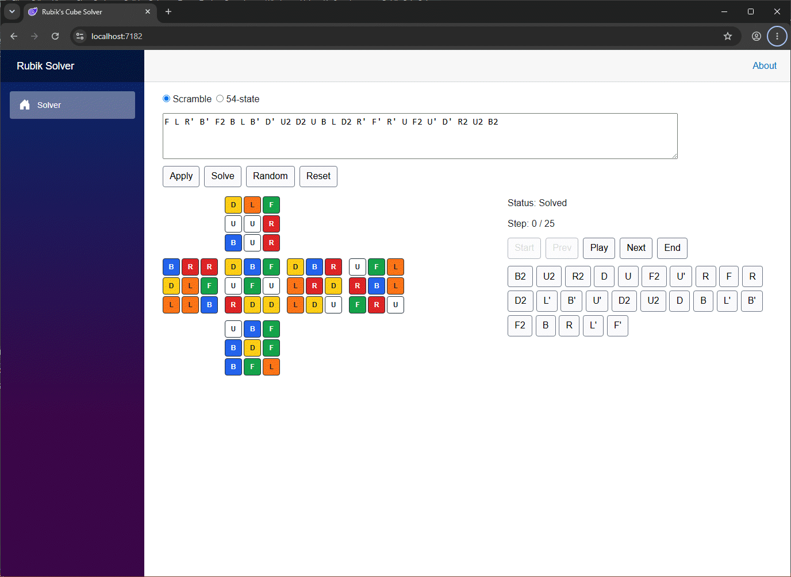

# rubiks-cube-solver

Rubik's Cube solver and 2D Blazor visualizer written in .NET 10.



Current implementation status:

- Solution skeleton with Core, Solver, CLI, Web, and test projects.
- Immutable 54-facelet cube model.
- MVP move parsing for `U R F D L B` with optional `'`, `i`, or `2` suffixes.
- Generated sticker move tables from one coordinate mapping.
- Sticker-level and cubie-level 54-facelet physical validation.
- Deterministic scramble generation.
- Verified inverse-scramble solver.
- CLI commands for solve, validate, random, visualize, and normalize.
- Bounded verified 54-facelet state solver.
- 2D Blazor cube-net visualizer with playback controls.
- Unit tests for Core, Solver, and CLI behavior.

Arbitrary unsolved 54-facelet state solving uses a bounded verified search by default. If no solution is found within the configured depth, the solver returns `MaxDepthExceeded` instead of presenting an unverified answer.

## Build

```bash
dotnet restore
dotnet build
dotnet test
```

## CLI examples

```bash
dotnet run --project src/RubiksCube.Cli -- solve --scramble "R U R' U'"
dotnet run --project src/RubiksCube.Cli -- solve --scramble "R U R' U'" --format json
dotnet run --project src/RubiksCube.Cli -- validate --state "UUUUUUUUURRRRRRRRRFFFFFFFFFDDDDDDDDDLLLLLLLLLBBBBBBBBB"
dotnet run --project src/RubiksCube.Cli -- random --length 25 --seed 123
dotnet run --project src/RubiksCube.Cli -- visualize --scramble "R U R' U'"
dotnet run --project src/RubiksCube.Cli -- normalize --scramble "R R U U'"
```

## Web app

```bash
dotnet run --project src/RubiksCube.Web
```

Open the shown local URL and use the solver page.
